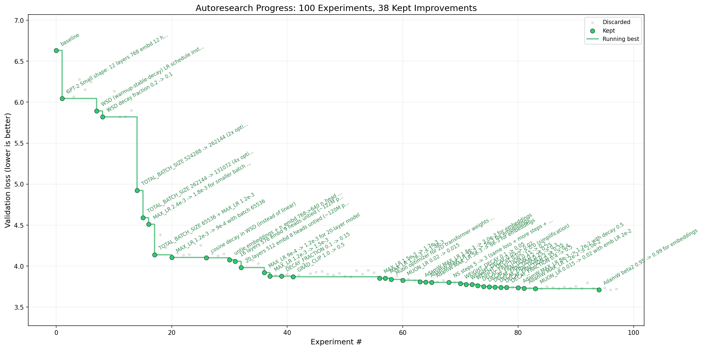

# Autoresearch: Autonomous LLM Pretraining Optimization

This project uses a Claude agent to autonomously improve LLM pretraining. Inspired by Andrej Karpathy's autoresearch post, though heavily modified to match my model's architecture and mirror real training conditions as closely as possible — so the findings could be directly applied. What remains from the original is the core idea, the agent prompt, and the visualization notebook.

The agent's experiments and commits live in the autoresearch/mar16 branch. The master branch contains the initial baseline configuration.



# How it works
The agent has full access to modify both the training script and the model architecture. Each iteration it makes a change, runs the experiment, analyzes the results, commits to the git repo, and repeats. It runs on an RTX 3090 with a fixed 20-minute window per experiment (~3 experiments per hour).

# Results
Over 100 experiments (~33 hours of autonomous work), the agent found 38 improvements — from learning rate and batch size tweaks to changes in the optimizer itself and its hyperparameters. Validation loss dropped from 6.63 to 3.71, a 44% improvement.

Not all of these translate directly to full-scale pretraining, but the results are compelling. This approach could be especially useful in classical ML, where you want to squeeze every last bit of performance out of your model.

**Final configuration**

| Parameter | Value |
|-----------|-------|
| val_loss | 3.711 (44% improvement from 6.631) |
| Architecture | 20 layers, 512 embd, 8 heads, SwiGLU, RoPE, dpn norm, untied embeddings (~120M params) |
| Optimizer | Muon (2D weights) + AdamW (embeddings, betas=0.9/0.99) |
| Schedule | WSD, 50% cosine decay, warmup=50 |
| Batch size | 65536, no weight decay, grad_clip=0.5 |

# Project structure
```
├── train.py          # Model architecture + training loop (modified by the agent each iteration)
├── prepare.py        # Dataset download and tokenization
├── program.md        # Agent prompt / instructions given to Claude
├── analysis.ipynb    # Visualization notebook for experiment results
├── results.tsv       # Log of all experiments (val_loss, config, notes)
├── progress.png      # Plot of validation loss over experiments
└── pyproject.toml    # Python project dependencies
```
