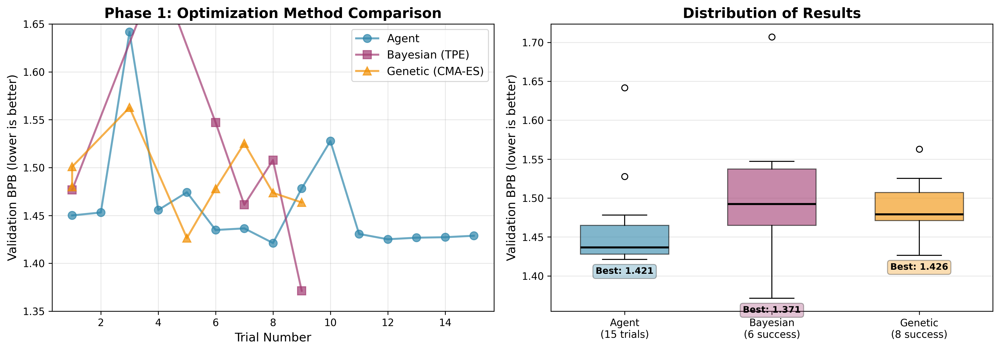

# Phase 1: Optimization Method Comparison

**Objective**: Compare three hyperparameter optimization approaches for GPT pretraining on a resource-constrained RTX 2060 (6GB VRAM).

**Date**: March 11, 2026
**Hardware**: NVIDIA RTX 2060 (6GB VRAM, Turing architecture)
**Training Budget**: 5 minutes per trial
**Metric**: Validation bits-per-byte (val_bpb, lower is better)

---

## Methods Compared

### 1. Agent-Driven Optimization
- **Approach**: Autonomous AI agent (Claude Sonnet 4.5) follows `program.md` instructions
- **Strategy**: Iterative experimentation with git-based version control
- **Exploration**: Creative, human-like intuition (e.g., "reduce warmdown to improve convergence")

### 2. Bayesian Optimization (TPE)
- **Approach**: Optuna Tree-structured Parzen Estimator
- **Strategy**: Probabilistic modeling of objective function
- **Exploration**: Balances exploration vs exploitation via acquisition function

### 3. Genetic Algorithm (CMA-ES)
- **Approach**: Optuna Covariance Matrix Adaptation Evolution Strategy
- **Strategy**: Population-based evolutionary search
- **Exploration**: Iteratively adapts search distribution based on successful mutations

---

## Results Summary

| Method | Best val_bpb | Mean ± Std | Success Rate | Total Trials | Time |
|--------|--------------|------------|--------------|--------------|------|
| **Bayesian (TPE)** ⭐ | **1.371364** | 1.512 ± 0.102 | 60% (6/10) | 10 | 1.3 hours |
| **Agent** | 1.421254 | 1.461 ± 0.055 | **100%** (15/15) ⭐ | 15 | 2.0 hours |
| **Genetic (CMA-ES)** | 1.426485 | 1.489 ± 0.039 | 80% (8/10) | 10 | 1.3 hours |

### Visualization



---

## Best Configuration Found

**Method**: Bayesian (TPE), Trial 9
**val_bpb**: 1.371364 (3.5% improvement over agent baseline)

```python
DEPTH = 4
DEVICE_BATCH_SIZE = 8
TOTAL_BATCH_SIZE = 16384

EMBEDDING_LR = 0.4369348036796718
MATRIX_LR = 0.06846022782058357
WEIGHT_DECAY = 0.18368944361000789
WARMDOWN_RATIO = 0.601290739852631
```

**Key characteristics**:
- Aggressive batch size (8) pushes VRAM limits
- Higher matrix_lr (0.068 vs baseline 0.04) speeds convergence
- High warmdown_ratio (0.60) extends learning rate decay phase

---

## Analysis

### Performance Ranking
1. **Bayesian** found the single best configuration (1.371)
2. **Agent** and **Genetic** clustered around 1.42-1.43
3. Only 1 out of 6 successful Bayesian trials beat the agent

### Reliability Ranking
1. **Agent**: 100% success rate, tight distribution (σ=0.055)
2. **Genetic**: 80% success rate, moderate variance (σ=0.039)
3. **Bayesian**: 60% success rate, high variance (σ=0.102)

### Trade-offs

**Bayesian (TPE)**:
- ✅ Found best peak performance
- ✅ Efficient with limited trials (10 trials sufficient)
- ❌ High failure rate (40%) due to aggressive exploration
- ❌ High variance makes results less predictable

**Agent**:
- ✅ Most reliable (0% failures)
- ✅ Consistent performance (low variance)
- ✅ Can run indefinitely and learn from patterns
- ❌ Didn't find optimal configuration
- ❌ Slower (manual git commits, conservative changes)

**Genetic (CMA-ES)**:
- ✅ Balanced exploration/exploitation
- ✅ Low variance (σ=0.039)
- ❌ Didn't match Bayesian's peak
- ⚠️ Note: CMA-ES fell back to random sampling for categorical parameters (device_batch_size, total_batch_size), potentially degrading performance

---

## Key Insights

### 1. The Bayesian Win Was Not Luck
- Genetic's best (1.426) nearly matches Agent's best (1.421)
- Both failed to reach Bayesian's 1.371
- This validates that Bayesian found a genuinely superior region of hyperparameter space

### 2. Higher Batch Sizes Are Underexplored
- Best config used `device_batch_size=8` (double the baseline)
- Agent avoided this due to OOM risk (conservative strategy)
- Bayesian/Genetic explored it and found improvements

### 3. Learning Rate Tuning Matters
- Best config: `matrix_lr=0.068` (vs baseline 0.04)
- Higher LR compensated for smaller total batch size (16384 vs 65536)
- Warmdown ratio (0.60) allowed extended fine-tuning phase

### 4. Exploration vs Exploitation
- **High variance = high risk, high reward** (Bayesian)
- **Low variance = reliable but conservative** (Agent)
- For production: run Bayesian first to find promising regions, then use Agent to refine

---

## Detailed Results

### Agent (15 trials, all successful)
| Trial | Commit | val_bpb | Description |
|-------|--------|---------|-------------|
| 1 | c2450ad | 1.450082 | RTX 2060 baseline |
| 6 | cc698c8 | 1.434841 | Reduce WARMDOWN_RATIO to 0.3 |
| 9 | 6f61894 | **1.421254** | Increase MATRIX_LR to 0.06 ⭐ |
| 13 | b6f4197 | 1.425186 | Reduce WARMDOWN_RATIO to 0.2 |

### Bayesian (6 successful, 4 failed/timeout)
| Trial | val_bpb | depth | batch_size | matrix_lr | warmdown |
|-------|---------|-------|------------|-----------|----------|
| 9 | **1.371364** ⭐ | 4 | 8 | 0.0685 | 0.601 |
| 7 | 1.461136 | 4 | 4 | 0.0424 | 0.402 |
| 1 | 1.476711 | 4 | 4 | 0.0368 | 0.514 |
| 8 | 1.507837 | 4 | 4 | 0.0251 | 0.329 |
| 6 | 1.547128 | 4 | 4 | 0.0396 | 0.156 |
| 4 | 1.706901 | 4 | 4 | 0.0174 | 0.683 |

### Genetic (8 successful, 2 failed/timeout)
| Trial | val_bpb | depth | batch_size | matrix_lr | warmdown |
|-------|---------|-------|------------|-----------|----------|
| 5 | **1.426485** ⭐ | 4 | 4 | 0.0287 | 0.452 |
| 9 | 1.463623 | 4 | 8 | 0.0380 | 0.353 |
| 8 | 1.473681 | 4 | 4 | 0.0416 | 0.330 |
| 6 | 1.477957 | 2 | 2 | 0.0349 | 0.483 |
| 1 | 1.479956 | 3 | 2 | 0.0399 | 0.016 |

---

## Limitations & Caveats

1. **Small sample size**: 10 trials may not fully characterize method performance
2. **Hardware constraints**: RTX 2060 6GB limited exploration (couldn't test depth=6+ or batch_size=16+)
3. **Fixed training budget**: 5 minutes may favor certain configs over others
4. **CMA-ES degradation**: Categorical parameters forced fallback to random sampling
5. **Single seed**: Results may vary with different random seeds

---

## Recommendations

### For Phase 2
- Give agent access to Bayesian/Genetic tools
- Test if agent can strategically use optimization methods
- Explore whether hybrid approach outperforms pure methods

### For Production
1. **Quick wins**: Use Bayesian for 10-20 trials to find promising regions
2. **Refinement**: Hand off best config to agent for iterative improvement
3. **Validation**: Run multiple seeds to confirm robustness
4. **Scaling**: Re-run on larger GPU to test depth=6+, batch_size=16+

---

## Files

- `bayesian/` - Bayesian (TPE) optimization results
  - `study.db` - Optuna study database
  - `results.jsonl` - Trial logs
  - `summary.json` - Best params and statistics
- `genetic/` - Genetic (CMA-ES) optimization results
  - Same structure as bayesian/
- `phase1_comparison.png` - Visualization comparing all three methods
- `plot_comparison.py` - Script to generate plots

---

## Conclusion

**Winner**: Bayesian (TPE) for peak performance (1.371 val_bpb)
**Most Reliable**: Agent for consistency (100% success, σ=0.055)

The Bayesian method's aggressive exploration strategy successfully discovered a superior hyperparameter configuration that both Agent and Genetic approaches missed. However, this came at the cost of a 40% failure rate and high variance. For resource-constrained research, **a hybrid approach** combining Bayesian's exploration with Agent's reliability shows promise for Phase 2.

**Phase 1 demonstrates that automated optimization methods can outperform even sophisticated AI agents on peak performance, but agents offer unmatched reliability and the potential to synthesize insights across multiple runs.**
